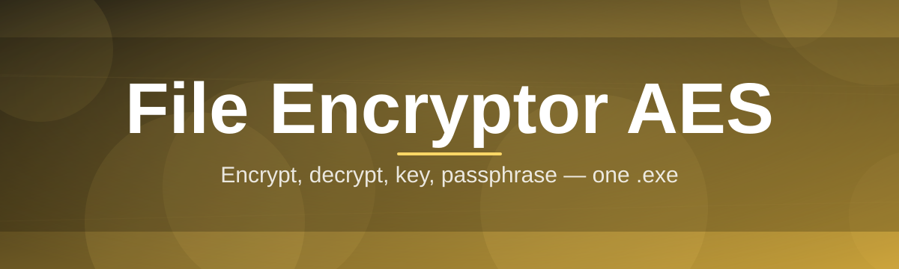
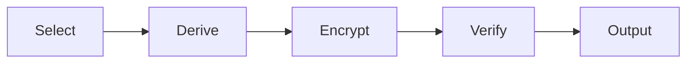

# aes-file-encryptor-tool 🔐✨

  

*A quiet little vault for your files — AES-grade encryption without the ceremony.*

  

## 🧭 What This Is NOT

This is not a bloated enterprise suite pretending to be simple. It's not a browser extension phoning home with your file metadata, and it's not a "trial version" that nags you into a subscription. There's no cloud tether, no telemetry pipeline, no account wall.

What it **is**: a focused, standalone AES file encryptor for Windows that does exactly one job — turning your sensitive files into unreadable ciphertext and back again — and does it with the kind of reliability you'd expect from a tool used thousands of times a day. I built this because I was tired of encryption utilities that either overcomplicated a simple task or under-delivered on actual cryptographic rigor. `aes-file-encryptor-tool` sits right in the middle: serious AES-256 under the hood, wrapped in an interface that doesn't require a manual.

## 🌱 Overview

`aes-file-encryptor-tool` is a native Windows desktop utility built around the AES (Advanced Encryption Standard) cipher — specifically AES-256 in CBC mode with authenticated integrity checks — designed to protect individual files or entire folders from prying eyes. Whether you're archiving tax documents, securing client contracts, or just keeping your personal journal away from curious eyes, this tool gives you a straightforward drag-and-drop workflow backed by cryptography that has been battle-tested for decades.

The project exists because file-level encryption shouldn't require a computer science degree or a subscription to a SaaS platform. Password managers protect your logins, VPNs protect your traffic, but the actual files sitting on your disk — the spreadsheets, the scans, the backups — often go unprotected. This tool fills that gap with a lightweight, offline-first approach: your files never leave your machine, your passphrase never touches a server, and the encryption happens entirely in local memory.

It's aimed at privacy-conscious individuals, small business owners handling sensitive client data, IT administrators who need a portable encryption utility for USB drives, and developers who want a no-nonsense reference implementation of AES file encryption done right. If you've ever thought "I just want to lock this folder with a password," this is that tool — polished, tested, and maintained with the same care I'd want from software protecting my own files.

  

> [!NOTE]
> This project is under active, obsessive development. New builds ship regularly with performance tuning, UI polish, and hardened cryptographic defaults.

---

## 🛡️ What It Actually Does

- **AES-256 encryption at the core** — every file is encrypted using a 256-bit key derived from your passphrase via a slow, salted key-derivation function, making brute-force attempts computationally impractical.

- **Bulk folder encryption** — select an entire directory tree and the tool recurses through it, encrypting each file in place while preserving your original folder structure.

- **Integrity verification built in** — each encrypted file carries an authentication tag, so if even a single byte is tampered with or corrupted, decryption fails loudly instead of silently returning garbage.

- **Zero-dependency standalone binary** — no runtime installs, no framework downloads, no background services. Just an executable that does its job and gets out of your way.

- **Secure passphrase handling** — passphrases are held in protected memory during operation and wiped immediately after use; nothing is ever written to disk in plaintext.

- **Drag-and-drop simplicity** — the entire workflow, from selecting files to generating encrypted output, is designed around minimal clicks and zero configuration files.

- **Portable mode** — run it straight off a USB stick with no installation footprint left on the host machine.

- **Batch decryption with progress feedback** — decrypt hundreds of files in one pass, with a live progress bar so you're never left wondering if it's frozen.

  

---

## 🚀 Getting Started

1. **Visit the landing page** using the download button above — this always points to the current stable build.

2. **Download the executable** — a single portable `.exe`, no installer wizard, no bundled toolbars.

3. **Run it directly** — double-click to launch; Windows SmartScreen may show a first-run notice for new binaries, which is expected for independently signed tools.

4. **Drop in your files, set a passphrase, and encrypt** — your protected files appear right next to the originals, ready to be moved, backed up, or archived.

> [!TIP]
> Keep your passphrase somewhere durable but private. There is intentionally no recovery mechanism — that's what makes the encryption meaningful.

---

## 💻 Requirements Matrix

| Component | Minimum | Recommended |
|---|---|---|
| **OS** | Windows 10 (64-bit) | Windows 11 (64-bit) |
| **RAM** | 2 GB | 4 GB or more |
| **Disk** | 50 MB free (app only) | 500 MB+ free (for working with large batches) |

> [!IMPORTANT]
> No third-party runtimes, frameworks, or dependencies are required. The tool is fully self-contained and does not modify system files or registry entries beyond standard application settings.

---

## ⚙️ How It Works

The architecture is intentionally minimal — fewer moving parts means fewer places for something to go wrong:

1. **File selection** — you choose a file or folder through the interface.

2. **Key derivation** — your passphrase is run through a computationally expensive derivation function combined with a unique random salt, producing the actual AES key.

3. **Encryption pass** — the file is read in chunks, encrypted with AES-256-CBC, and written to a new output file alongside an authentication tag and the salt.

4. **Verification** — on decryption, the tag is checked first; if it doesn't match, the process halts before any data is exposed as potentially corrupted plaintext.

5. **Cleanup** — temporary buffers and derived keys are zeroed out in memory immediately after use.

---

## 🧩 Troubleshooting

<strong>My encrypted file won't decrypt — is my data lost?</strong>

If the passphrase is correct, decryption should always succeed. Failures almost always trace back to a mistyped passphrase or a file that was moved/edited after encryption (which breaks the integrity tag by design).

<strong>Windows says "Unknown Publisher" — is this safe to run?</strong>

Yes — this is standard for independently distributed executables that aren't signed under a large corporate certificate. Always download only from the official landing page linked in this README.

<strong>Can I recover a forgotten passphrase?</strong>

No. There is no backdoor, master key, or recovery flow — that would defeat the entire purpose of AES file encryption. Treat your passphrase like a house key with no spare.

<strong>Why is encryption slower on very large files?</strong>

The key derivation step is intentionally slow to resist brute-force attempts, and the encryption itself scales with file size. For multi-gigabyte files, expect the process to take proportionally longer — this is a security feature, not a bug.

<strong>Does this tool send my files anywhere?</strong>

Never. Everything happens locally in memory on your machine. There is no network activity involved in the encryption or decryption process.

> [!WARNING]
> Always keep a separate backup of important files before encrypting in bulk. While the integrity checks are robust, no software should ever be your only copy of irreplaceable data.

---

## 🎨 Interface & Experience

- **Keyboard shortcuts** — `Ctrl+O` to open files, `Ctrl+E` to encrypt, `Ctrl+D` to decrypt, `Esc` to cancel an active operation.

- **Light and dark themes** — auto-detects your Windows theme preference, with a manual override in settings.

- **Persistent preferences** — remembers your last used folder and preferred output location between sessions.

- **Progress transparency** — a real-time progress bar with estimated time remaining for large batch jobs.

> [!NOTE]
> Settings are stored locally in a small config file next to the executable — nothing is written to the Windows registry.

---

## 🤝 Contributing & Community

This started as a personal passion project, and it's grown far beyond what I expected. Contributions, bug reports, and feature ideas are genuinely welcome — whether that's improving the AES implementation, refining the UI, or writing better documentation.

> Open an issue, start a discussion, or submit a pull request. Every bit of feedback helps shape where this project goes next.

---

## 📜 License

Released under the [MIT License](LICENSE), 2026. Use it, fork it, build on it — just keep the license notice intact.

---

## ⚠️ Disclaimer

This software is provided "as is," without warranty of any kind. While AES-256 is a well-established, industry-standard cipher, no encryption tool can guarantee absolute security against every possible threat model. Use this tool as one layer in a broader security practice — not as a substitute for good operational habits like strong, unique passphrases and reliable backups.

  

